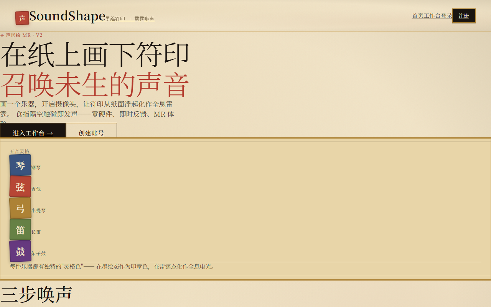
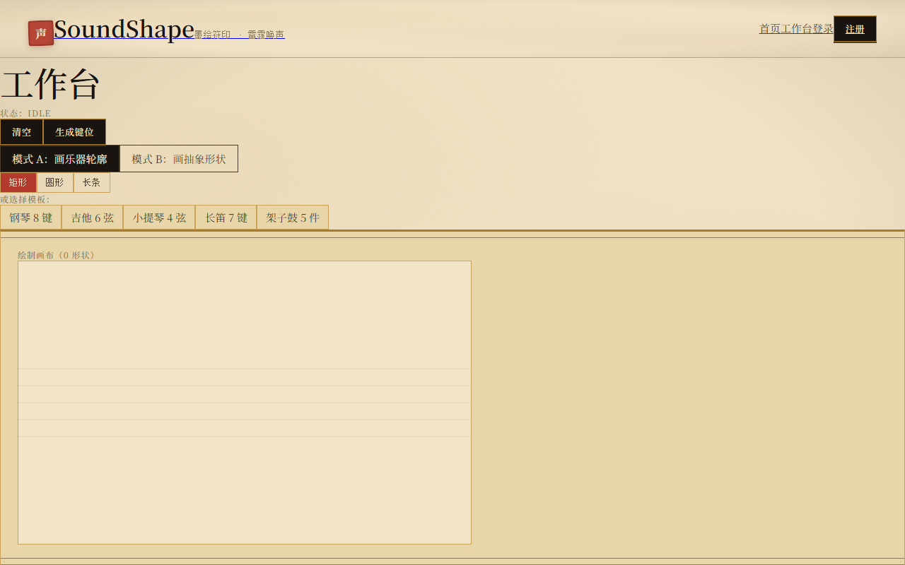
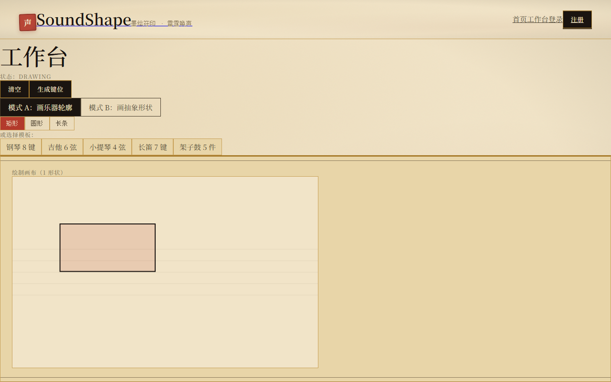
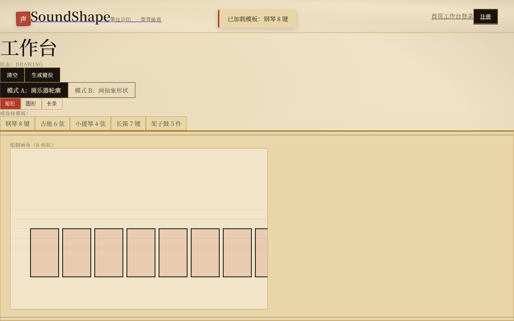
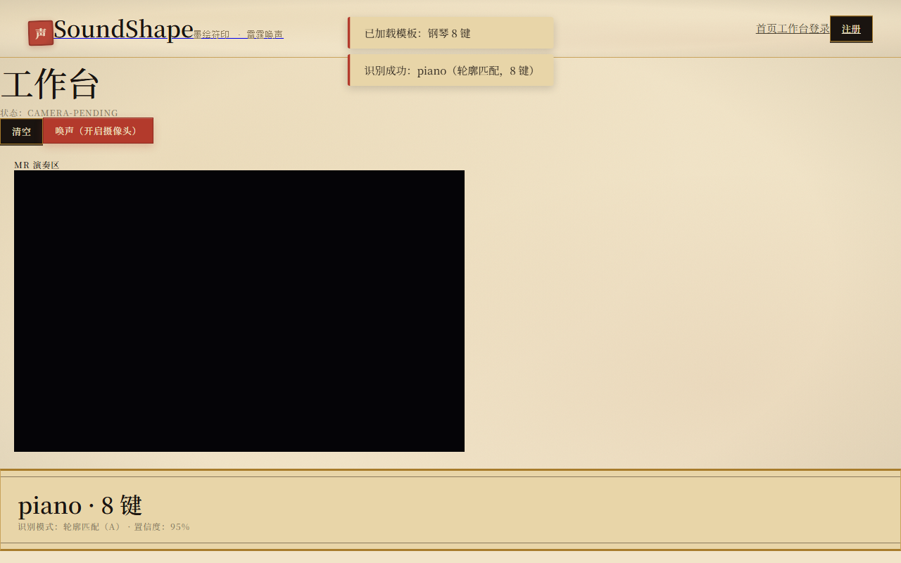
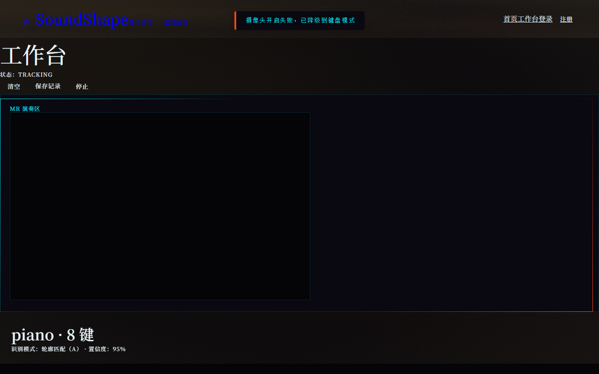
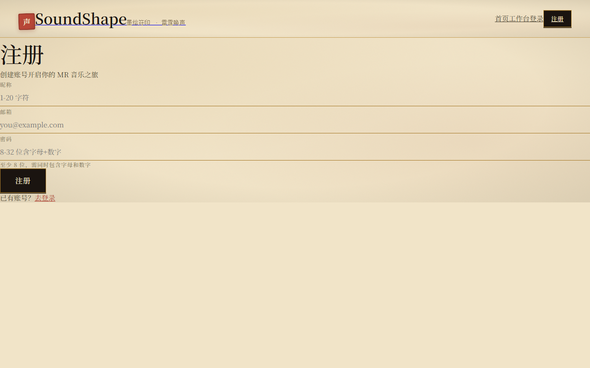
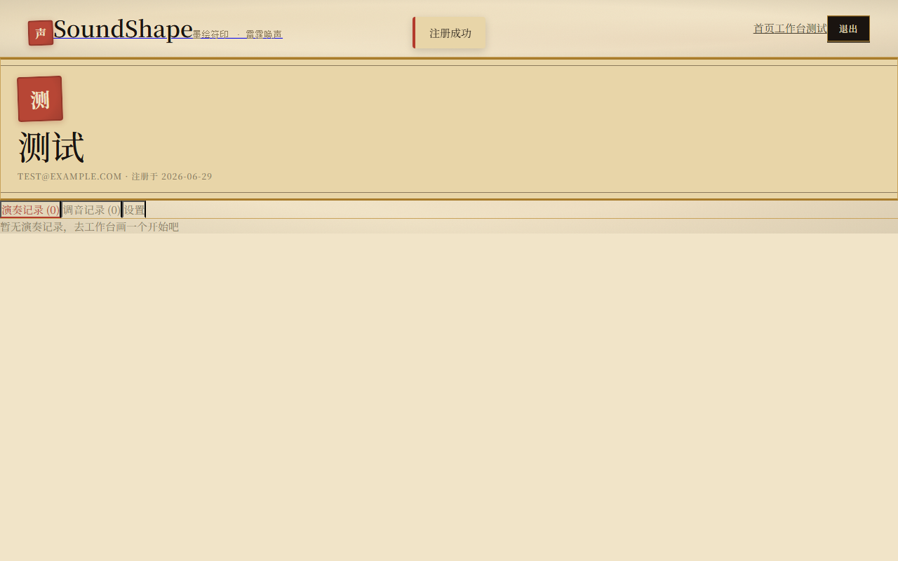
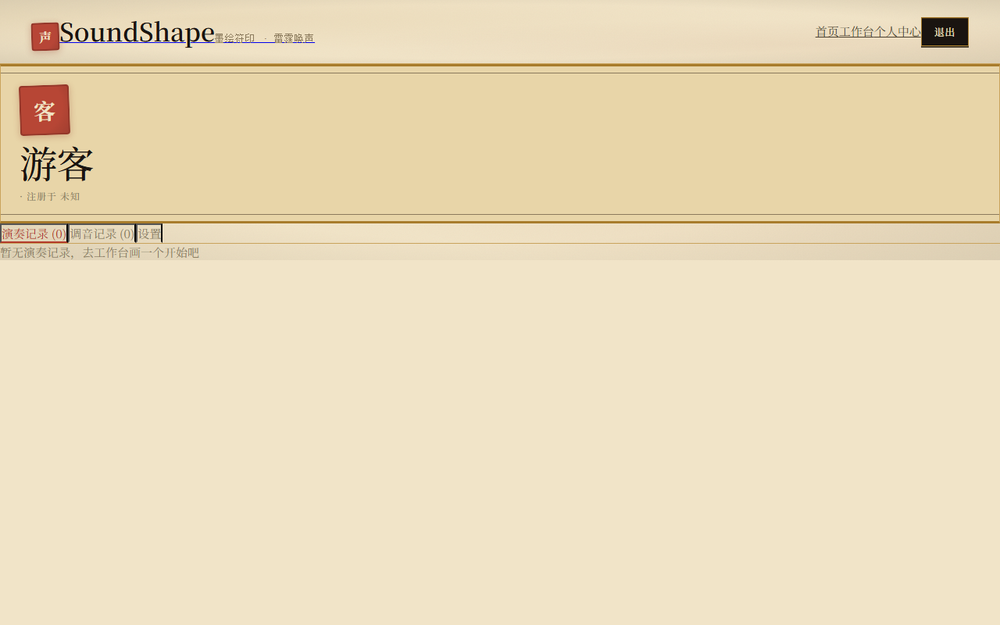

# 声形绘 SoundShape

> 画出来，就能弹 —— 画图生成虚拟键位 + 摄像头实时手部追踪 + 区域触发演奏 + 激光特效



一个面向非技术用户的 Web 音乐应用。在画布上画几个形状（方块/长条/圆点），系统按形状特征自动生成虚拟音键区，叠加到摄像头画面上，用手指在空中触碰即可演奏音乐，伴随激光光晕特效。**无需安装真实乐器，无需乐器识别，画几笔就能弹。**

---

## 核心特性

| 能力 | 说明 |
| --- | --- |
| 画图识别 | 画形状自动识别为 5 种乐器：钢琴 / 吉他 / 小提琴 / 长笛 / 架子鼓 |
| 手部追踪 | MediaPipe Hands 实时追踪 21 个关键点，延迟 < 100ms |
| 演奏触发 | 食指进入虚拟键位即触发音色 + 粒子爆裂 + 键位闪光 |
| 调音器 | 内置实时音高检测，支持 A4(440Hz) 校准与音名/cents 显示 |
| 个人中心 | 注册登录后可保存演奏记录与调音历史，支持回放与删除 |
| 双主题 | 浅色"白昼纸面" + 深色"暗夜雷电"两种主题无缝切换 |
| 响应式 | 桌面 / 平板 / 手机全适配，触控按钮 ≥ 44px |

---

## 识别规则

按形状特征自动推断乐器（[模块文档 M2](docs/specs/2026-06-28-soundshape-modules.md) 阈值）：

| 画法 | 识别为 | 置信度 |
| --- | --- | --- |
| 6 条竖向长条 | 吉他（6 根弦） | 95% |
| 4 条竖向长条 | 小提琴（4 根弦） | 92% |
| ≥ 5 个横向排列方块 | 钢琴（横向琴键） | 90% |
| 1 条横向长条 + ≥ 3 圆点 | 长笛（按键） | 88% |
| ≥ 3 个分散形状 | 架子鼓（鼓件） | 85% |

---

## 快速开始（小白一键启动）

### 方式一：双击启动器（推荐）

1. 下载本项目到本地并解压
2. 安装 [Python 3.10+](https://www.python.org/downloads/)（安装时勾选 **Add Python to PATH**）
3. 双击 `启动器.bat`
4. 选 `1` 启动前端服务，浏览器自动打开首页
5. 体验流程：**首页 → 工作台 → 画形状 → 识别 → 演奏 → 保存**

> 此模式为纯前端，所有数据保存在浏览器 localStorage，刷新不丢失，换浏览器/清缓存会丢失。

### 方式二：完整模式（含后端 + 数据库）

适合需要云端账号、跨设备同步演奏记录的场景。

```bash
# 1. 准备 PostgreSQL（本地安装 或 注册 Supabase 免费）
# 2. 配置后端环境
cd backend
copy .env.example .env
# 编辑 .env 填入 DATABASE_URL 和 JWT_SECRET
npm install
npm run migrate    # 建表

# 3. 双击 启动器.bat 选 [2]，或分别启动：
npm run dev        # 后端 :8787
# 新开终端
cd ..
python launcher/server.py --port 8000   # 前端 :8000
```

### 启动器菜单

| 选项 | 作用 |
| --- | --- |
| `[1]` | 启动前端服务（端口 8000），自动开浏览器 |
| `[2]` | 启动完整模式（前端 :8000 + 后端 :8787） |
| `[3]` | 运行自动化测试（86 项验收清单） |
| `[4]` | 停止所有本地服务 |
| `[5]` | 查看使用说明 |

---

## 项目结构

```
music voice/
├── 启动器.bat                    # 双击启动入口（菜单式）
├── launcher/                     # 快捷启动器
│   ├── server.py                 # Python 零依赖静态服务器
│   └── run_tests.py              # 自动化测试脚本（86 项）
├── soundshape-design/            # 前端（纯静态 HTML/JS）
│   ├── pages/                    # 7 个页面 × 2 主题 = 14 个 HTML
│   │   ├── home.html             # 首页
│   │   ├── workbench.html        # 工作台（画图 + 识别）
│   │   ├── workbench-result.html # 识别结果 + 调音引导
│   │   ├── workbench-play.html   # 演奏区（手部追踪 + 特效）
│   │   ├── login.html            # 登录
│   │   ├── register.html         # 注册
│   │   └── profile.html          # 个人中心（记录管理）
│   ├── assets/
│   │   ├── app.js                # 全站共享脚本（路由/存储/识别/音色/键盘）
│   │   ├── icons/                # 41 个 SVG 图标
│   │   └── hero-product-visual-v3.jpg
│   └── tests/screens/            # 10 张测试截图
├── backend/                      # 后端（Node.js + Express + TypeScript）
│   ├── src/
│   │   ├── server.ts             # 入口，含 /api/health
│   │   ├── config.ts             # 环境变量
│   │   ├── migrate.ts            # 数据库迁移
│   │   ├── routes/               # auth / records / tunings / layouts
│   │   ├── middleware/           # auth(JWT) / error
│   │   └── services/             # auth / db
│   ├── migrations/001_init.sql   # 建表 SQL
│   └── .env.example
└── docs/                         # 设计文档与实现计划
    ├── plans/2026-06-28-soundshape-implementation.md  # 34 个 Task 实现计划
    └── specs/                    # 6 份规格文档
        ├── 2026-06-28-soundshape-design.md        # 产品设计
        ├── 2026-06-28-soundshape-ui-design.md     # UI 设计
        ├── 2026-06-28-soundshape-modules.md       # 模块规格（M1-M13）
        ├── 2026-06-28-soundshape-api.md           # API 规格
        ├── 2026-06-28-soundshape-data-model.md    # 数据模型
        └── 2026-06-28-soundshape-modules.md       # 模块规格
```

---

## 技术栈

**前端**（纯静态，零构建）

- 原生 HTML + JavaScript（[app.js](soundshape-design/assets/app.js)）
- Tailwind CSS（CDN，Apple 极简风）
- Web Audio API（音色合成，[M6 参数](docs/specs/2026-06-28-soundshape-modules.md)）
- MediaPipe Hands（手部追踪，浏览器端推理）
- localStorage 持久化（无需后端即可运行）

**后端**（可选，云端保存）

- Node.js 18 + Express + TypeScript
- PostgreSQL（Supabase 免费档）
- JWT 鉴权 + bcryptjs 密码哈希

**启动器**

- Python 3.10+ 内置 http.server（零依赖）
- Windows .bat 菜单式入口

---

## 音色参数（M6 严格固定）

| 乐器 | 振荡器 | 包络 | 滤波器 |
| --- | --- | --- | --- |
| 钢琴 | triangle + sine×2 | A5ms D300ms S0.3 R500ms | lowpass 4000Hz |
| 吉他 | sawtooth + triangle | A2ms D800ms S0 R200ms | lowpass 2200Hz Q2 |
| 小提琴 | sawtooth×3 + LFO | A80ms D0 S0.8 R400ms | lowpass 3000Hz |
| 长笛 | sine + triangle + 噪声 | A30ms D0 S0.7 R200ms | lowpass 2500Hz |
| 架子鼓 | kick/snare/tom/cymbal | 各自合成 | — |

详见 [app.js](soundshape-design/assets/app.js#L216-L261) 的 `INSTRUMENT_PRESETS`。

---

## 键盘备用模式（M4）

摄像头不可用时，可用键盘演奏：

| 乐器 | 键位 → 音名 |
| --- | --- |
| 钢琴 | `A S D F G H J K` → C4 D4 E4 F4 G4 A4 B4 C5 |
| 吉他 | `1 2 3 4 5 6` → E2 A2 D3 G3 B3 E4 |
| 小提琴 | `1 2 3 4` → G3 D4 A4 E5 |
| 长笛 | `A S D F G H J` → C4 D4 E4 F4 G4 A4 B4 |
| 架子鼓 | `Q W E R T` → kick snare tom1 tom2 cymbal |

---

## 测试

按 [实现计划 Task 33](docs/plans/2026-06-28-soundshape-implementation.md) 端到端验收清单执行，覆盖 9 个阶段：

```
阶段 A 部署可达性    阶段 B 注册登录    阶段 C 画图识别
阶段 D 摄像头追踪    阶段 E 触发演奏    阶段 F 调音器
阶段 G 记录保存      阶段 H 曲库挑战    阶段 I 分享录制
阶段 J UI 一致性     阶段 K 响应式      阶段 L 错误兜底
```

运行测试：

```bash
# 方式一：启动器菜单选 [3]
启动器.bat

# 方式二：直接运行
python launcher/run_tests.py
```

最新结果：**86 / 86 项全部通过**，报告输出到 `launcher/test-report.txt`。

---

## 截图预览

| 首页 | 工作台导航 | 工作台空闲 | 绘制形状 |
| :---: | :---: | :---: | :---: |
|  |  |  |  |

| 模板 | 生成键位 | 摄像头 | 注册 |
| :---: | :---: | :---: | :---: |
|  |  |  |  |

| 注册完成 | 个人中心 |
| :---: | :---: |
|  |  |

---

## 文档

完整设计与实现文档位于 [`docs/`](docs/)：

- [实现计划](docs/plans/2026-06-28-soundshape-implementation.md) — 7 阶段 34 个 Task，含审查规范
- [产品设计](docs/specs/2026-06-28-soundshape-design.md) — 产品定位、交互流程、技术架构
- [UI 设计](docs/specs/2026-06-28-soundshape-ui-design.md) — 视觉系统、组件语言
- [模块规格](docs/specs/2026-06-28-soundshape-modules.md) — M1-M13 模块定义
- [API 规格](docs/specs/2026-06-28-soundshape-api.md) — 接口字段、错误码
- [数据模型](docs/specs/2026-06-28-soundshape-data-model.md) — localStorage key、表结构

---

## 部署

| 层 | 平台 | 说明 |
| --- | --- | --- |
| 前端 | Vercel | 静态托管，CDN 加速 |
| 后端 | Render | Node.js 服务，免费档冷启动 < 30s |
| 数据库 | Supabase | PostgreSQL 免费档，500MB |

部署配置详见 [实现计划 Task 32](docs/plans/2026-06-28-soundshape-implementation.md)。

---

## 常见问题

**Q: 提示"python 不是内部命令"？**
A: 安装 [Python 3.10+](https://www.python.org/downloads/)，安装时勾选 **Add Python to PATH**。

**Q: 端口被占用？**
A: 启动器菜单选 `[4]` 停止所有服务，或修改 `launcher/server.py` 默认端口。

**Q: 画图后识别不出？**
A: 至少画 4 个独立形状（矩形/圆点），形状之间留间隙。参考上方"识别规则"。

**Q: 摄像头无法开启？**
A: 浏览器需 HTTPS 或 localhost 才能调用摄像头。本地访问 `http://127.0.0.1:8000` 即可。MediaPipe CDN 加载失败时会自动降级到键盘模式。

**Q: 中文显示乱码？**
A: 启动器已自动切换 UTF-8 编码，无需手动处理。

**Q: 数据保存在哪里？**
A: 纯前端模式下保存在浏览器 localStorage（`ss_accounts` / `ss_records` / `ss_tunings` 等 key）。完整模式下保存到 PostgreSQL。

---

## 开源协议

本项目仅用于学习与展示。商用请联系作者。

---

## 致谢

- [MediaPipe Hands](https://google.github.io/mediapipe/solutions/hands.html) — 手部追踪
- [Web Audio API](https://developer.mozilla.org/zh-CN/docs/Web/API/Web_Audio_API) — 音色合成
- [Tailwind CSS](https://tailwindcss.com/) — 样式系统
- [Lucide Icons](https://lucide.dev/) — 图标库

---

<p align="center">画几笔，就能弹。让音乐回归直觉。</p>
